# D3 Workshop

## [Mike Bostock](https://bost.ocks.org/mike/) @mbostock

>Hello! These are my slides from a D3 workshop I gave at [VIZBI 2012](http://vizbi.org/2012/) on March 5. Over the course of three hours, we covered a large swath of introductory material. If you’re interested in learning D3, you might find these slides helpful as a guided tour. Many slides include links to other tutorials and resources to learn more. Scroll down or use the arrow keys to continue.

---

- Preface
- Selections
- Data
- Scales **&** Axes
- Shapes
- Layouts


## Outline

---

# Preface

>Before we get to the specifics of D3, I thought it’d be helpful to put things in context a bit, by discussing some of the design motivations. That way, you’ll have a better sense of the _why_ and not just the _how_.

---

# Visualizing **Data** with **Web Standards**

## D3 provides transformation; no new representation.

>A central tenet of D3 is to make visualization easier without introducing a new way of representing an image. D3 uses existing standards—namely HTML and SVG. This approach offers a whole host of benefits, including greater expressiveness, future-proofing, and compatibility with existing tools and technologies, such as CSS and debuggers.

---

# **Data** ↦ **Elements**

## Visualization requires visual encoding: mapping data to elements.

>Since D3 does not provide new representa­tion, the task of visualization is constructing a DOM from data. We must also update the DOM whenever the data changes, either due to dynamic ( _e.g._, realtime) data or interaction. In a visualization, each entity (or data point) has a corresponding element (or graphical mark). D3 helps you maintain this mapping from data to elements.

---

# **Data** -Driven **Documents**

## The name “D3” refers to the [W3C Document Object Model](https://www.w3.org/TR/dom/).

---

# Web Standards

## There are myriad free resources for learning standards.

>“Learning D3” is largely learning web standards. Fortunately, there are lots of resources for learning standards!

---

# **HTML** Resources

## [HTML5 Spec](https://www.w3.org/TR/html5/), [HTML5 for Developers](https://developers.whatwg.org/), [MDN](https://developer.mozilla.org/en/HTML), [Dive Into HTML5](http://diveintohtml5.info/)

>Specs are good for reference, but a bit overwhelming if you’re not sure where to start. Specs can be more helpful for understanding interesting techniques found in the wild.

---

```html
<!DOCTYPE html>
<meta charset="utf-8">
<body>
Hello, world!
```

## [hello-world.html](https://bost.ocks.org/mike/d3/workshop/hello-world.html)

>Hat tip to Paul Irish for showing the beauty of minimalist HTML5 markup. All those extraneous tags? Poof!

---

# **SVG** Resources

## [SVG Spec](https://www.w3.org/TR/SVG/), [MDN](https://developer.mozilla.org/en/SVG), [D3 API Reference](https://github.com/mbostock/d3/wiki/SVG-Shapes)

>SVG lets you draw vector graphics in the browser, allowing much greater expressiveness than HTML. You can do some stuff (like simple bar charts and input controls) using only HTML, but mostly you’ll want to use SVG to visualize data.

---

```html
<!DOCTYPE html>
<meta charset="utf-8">
<svg width="960" height="500">
  <text y="12">
    Hello, world!
  </text>
</svg>
```

## [hello-svg.html](https://bost.ocks.org/mike/d3/workshop/hello-svg.html)

>You can embed SVG directly inside HTML, much like an image tag. Of course, if you’re using D3 for data visualization, the SVG will more often be constructed by JavaScript. Sometimes you might have static bits of SVG; you can always modify it later.

---

# **CSS** Resources

## [CSS Spec](https://www.w3.org/TR/CSS2/), [Selectors Spec](https://www.w3.org/TR/selectors/)

>Unlike HTML and SVG, CSS doesn’t introduce new representation; it’s just a way of adding aesthetics and presentation (such as colors and fonts). CSS greatly simplifies your code, so I highly recommend it! For example, rather than assigning colors explicitly via JavaScript, assign a class. Then you can easily change the definition or apply multiple styles simultaneously.

---

```html
<!DOCTYPE html>
<meta charset="utf-8">
<style>
body { background: steelblue; }
</style>
<body>
Hello, world!
```

## [hello-css.html](https://bost.ocks.org/mike/d3/workshop/hello-css.html)

---

# **JavaScript** Resources

## [MDN](https://developer.mozilla.org/en/JavaScript), [Douglas Crockford](http://javascript.crockford.com/) ’s [JavaScript: The Good Parts](http://shop.oreilly.com/product/9780596517748.do)

>If beauty is in the eye of the beholder, JavaScript is a beautiful language. D3 uses some functional idioms (lots of closures and higher-order programming). These concepts can be unfamiliar but are very elegant and powerful. If you’re unsure how some piece of D3 code works, reading about these language features may help.

---

```html
<!DOCTYPE html>
<meta charset="utf-8">
<body>
<script>
console.log("Hello, world!");
</script>
```

## [hello-javascript.html](https://bost.ocks.org/mike/d3/workshop/hello-javascript.html)

---

# Start small!

## You don’t need to master everything at once.

---

# Getting Started

## [http://d3js.org/](https://d3js.org/)

---

```html
<!DOCTYPE html>
<meta charset="utf-8">
<style>/* CSS */</style>
<body>
<script src="d3.v2.js"></script>
<script>/* JavaScript */</script>
```

## [hello-d3.html](https://bost.ocks.org/mike/d3/workshop/hello-d3.html)

>Use this template to get started with D3. I recommend hosting a copy of d3.v2.js yourself (either download the file, download the entire repository from GitHub, or clone the git repo). Alternatively, you can link to the latest version on [mbostock.github.com](https://d3js.org/d3.v2.js).

---

```javascript
> python -m SimpleHTTPServer 8888 &
```

## A web server is required when loading external data ( _e.g._, d3.csv).

>D3’s bundled examples won’t work locally unless you start a web server and access them from http://localhost, rather than file://.

---

# Developer Tools ⌥⌘I

>Inspect elements, inspect computed styles, change styles and attributes on the fly! Best. Tool. Ever.

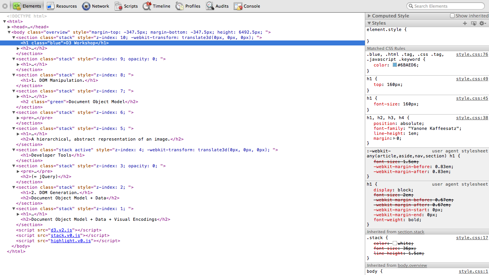

---

# JavaScript Console ⌥⌘J

>Gone are the days of debugging by alert(); use the console to explore D3 interactively. If you want to understand how something works, break it down into individual steps and look at the return values (the selection) and the DOM along the way. Also, use breakpoints and the debugger! Step into the code and observe local variables. It’s super effective.

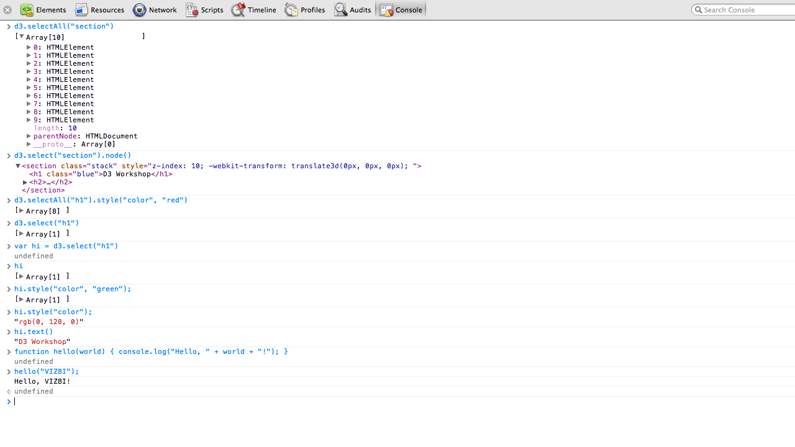

---

# **D3** Resources

## [D3 API Reference](https://github.com/mbostock/d3/wiki/API-Reference), [D3 Wiki](https://github.com/mbostock/d3/wiki), [D3 Group](https://groups.google.com/group/d3-js), [D3 Stack Overflow](https://stackoverflow.com/questions/tagged/d3.js)

>Although not as established as standards, there are still many available resources for learning D3, including a variety of contributed tutorials and talks. Make use of the d3-js group! I answer support questions nearly everyday and love to hear from you. Unless you are angry. In which case you should enjoy some time outside.

---

# Selections

>Selections of elements are D3’s atomic operand; the basic idea is familiar to you already if you know jQuery.

---

# Selectors

## CSS provides a handy way to refer to specific elements.

---

```css
pre, code {
  font-family: "Menlo", monospace;
  font-size: 48px;
}
```

## CSS assigns style rules via selectors.

>This snippet applies two style properties (setting the font family and size) to all `<pre>` and `<code>` elements. CSS is a declarative language for assigning styles to elements.

---

```javascript
#foo        // <any id="foo">
foo         // <foo>
.foo        // <any class="foo">
[foo=bar]   // <any foo="bar">
foo bar     // <foo><bar></foo>
```

## Simple selectors identify elements by one facet.

>There are quite a few more selectors not covered here, but these are the ones you’ll need most often.

---

```javascript
foo.bar     // <foo class="bar">
foo#bar     // <foo id="bar">
```

## Compound selectors identify elements by two or more facets.

---

```css
document.querySelectorAll("pre, code")
```

## The W3C standardized selector support for JavaScript.

>The W3C Selectors API provides select _ors_, but not select _ions_. So, you can select elements easily, yet you must iterate over them and assign attributes and styles for each. Hence the need for JavaScript libraries to make web development easier.

---

```css
d3.selectAll("pre, code")
```

## D3 provides shorthand for selecting and manipulating.

>Or, in jQuery: $("pre, code").

---

# Selections are Arrays

## Use developer tools to select, inspect, modify and experiment.

---

```javascript
// select all <circle> elements
var circle = d3.selectAll("circle");

// set some attributes and styles
circle.attr("cx", 20);
circle.attr("cy", 12);
circle.attr("r", 24);
circle.style("fill", "red");
```

## The attr and style methods set attributes and styles, respectively.

>One thing to note: numbers and other values are automatically coerced to strings when setting attributes and styles. So, you don’t have to do that yourself (which is nice), and you can also use helper classes such as d3.rgb and d3.hsl.

---

```javascript
// select all <circle> elements
// and set some attributes and styles
d3.selectAll("circle")
    .attr("cx", 20)
    .attr("cy", 12)
    .attr("r", 24)
    .style("fill", "red");
```

## Method chaining allows shorter (and more readable) code.

---

# selection.append

## Create new elements, append, and select.

---

```javascript
// select the <body> element
var body = d3.select("body");

// add an <h1> element
var h1 = body.append("h1");
h1.text("Hello!");
```

## With one element selected, adds one element.

---

```javascript
// select all <section> elements
var section = d3.selectAll("section");

// add an <h1> element to each
var h1 = section.append("h1");
h1.text("Hello!");
```

## With many elements selected, adds one element to each.

---

```javascript
var h1 = d3.selectAll("section")
    .style("background", "steelblue")
  .append("h1")
    .text("Hello!");
```

## **Use caution** with method chaining: append returns a new selection!

>With method chaining, I normally use four spaces to indent. However, I use two spaces for operations that change the selection, such as append. This causes operations that change the context to stick out. In this snippet, the entire expression evaluates to the appended `<h1>` elements, even though we started by selecting `<section>` elements.

---

# Add many elements?

## No single operation; this brings us to our next topic…

---

# Data

---

# Data are Arrays

## You can represent data however you like (in JavaScript).

>Selections are arrays, and data are arrays. Coincidence? Nope.

---

```javascript
// A bar chart, perhaps?
var data = [1, 1, 2, 3, 5, 8];
```

## Data can be numbers.

>If you want to be fancy, you can call an array of numbers a **univariate dataset**.

---


## [bar-chart.html](https://bost.ocks.org/mike/d3/workshop/bar-chart.html)

---

```javascript
// A scatterplot, perhaps?
var data = [
  {x: 10.0, y: 9.14},
  {x:  8.0, y: 8.14},
  {x: 13.0, y: 8.74},
  {x:  9.0, y: 8.77},
  {x: 11.0, y: 9.26}
];
```

## Data can be objects.

>If you want to be fancy, you can call an array of objects a **multivariate dataset**.

---


## [dot-chart.html](https://bost.ocks.org/mike/d3/workshop/dot-chart.html)

>Nerd cred if you recognize this!

---

# **Data** ↦ **Elements**

## Use data to create multiple elements.

>D3 doesn’t provide a single method for creating multiple elements; instead, it provides a pattern for managing the mapping from data to elements. The way to create elements from scratch is a special case of the more generalized form.

---

```javascript
svg.selectAll("circle")
    .data(data)
  .enter().append("circle")
    .attr("cx", x)
    .attr("cy", y)
    .attr("r", 2.5);
```

## We want the selection **“circle”** to correspond to data.

>This common snippet creates new elements from data. The first line may be surprising—why select `<circle>` elements if you know they don’t exist? Well, you’re telling D3 that you want them to correspond to data. This parsimonious approach means that when you need to handle update and exit in the future (for your interactive or dynamic visualizations), it’s a simple extension of a pattern you already know.

---

```javascript
var circle = svg.selectAll("circle")
    .data(data);
```

## The **data** method computes the join, defining enter and exit.

>The data method does all the work. The enter and exit methods just return the subselections computed in the join.

---

```javascript
var circle = svg.selectAll("circle")
    .data(data);

circle.enter().append("circle");
```

## Appending to the **enter** selection creates the missing elements.

>The append method on enter selections is special; it still creates one new element per selected element, but it adds them to the parent node (here the SVG element).

---

```javascript
var circle = svg.selectAll("circle")
    .data(data);

circle.enter().append("circle")
    .attr("cx", x)
    .attr("cy", y)
    .attr("r", 2.5);
```

## The new elements are bound to data, so we can compute attributes.

>X and y here refer to accessor functions, such as function x(d) { return d.x; }. I couldn’t fit them on the slide. I commonly use anonymous functions to compute attributes from data.

---

# Enter **,** Update **&** Exit

## [Thinking with Joins](https://bost.ocks.org/mike/join)

>I wrote a [tutorial on joins](https://bost.ocks.org/mike/join) recently which is hopefully my best attempt yet at explaining D3’s data join. The data join is likely the hardest concept of D3 to grasp, but it’s a powerful way of manipulating the DOM.

---

# Enter

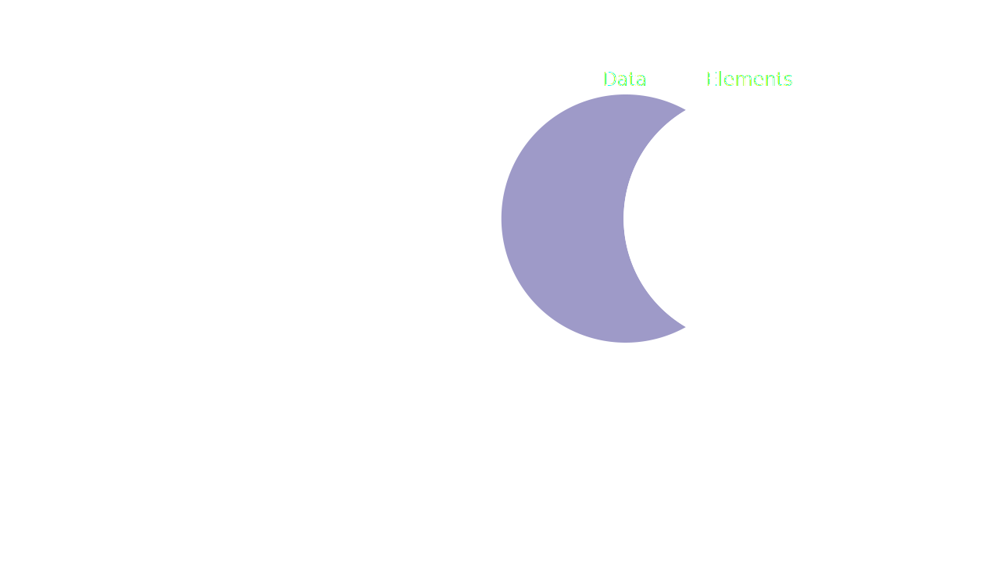

## New data, for which there were no existing elements.

---

```javascript
var circle = svg.selectAll("circle")
    .data(data)
  .enter().append("circle")
    .attr("cx", x)
    .attr("cy", y)
    .attr("r", 2.5);
```

## When initializing, you might ignore update and exit.

>This is the same code snippet as before. In effect, we’ve simplified the general pattern by assuming there are no updating or exiting elements.

---

# Update

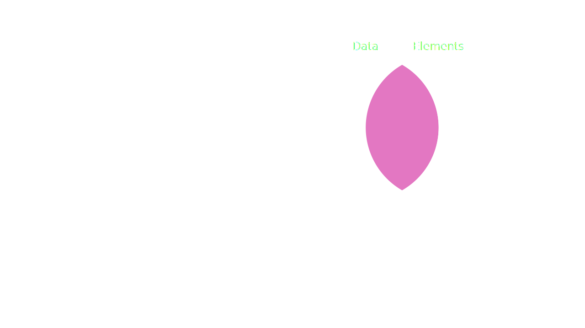

## New data that was joined successfully to an existing element.

---

```javascript
var circle = svg.selectAll("circle")
    .data(data)
    .attr("cx", x)
    .attr("cy", y)
    .attr("r", 2.5);
```

## When updating, you might ignore enter and exit.

---

# Exit

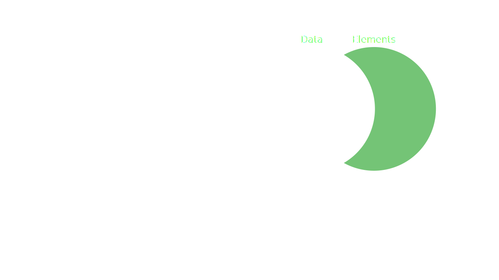

## Existing elements, for which there were no new data.

>I didn't include a code snippet here, but typically you just call selection.remove on exit. You can also create an exit transition, so that elements animate before removal.

---

# Enter **+** Update

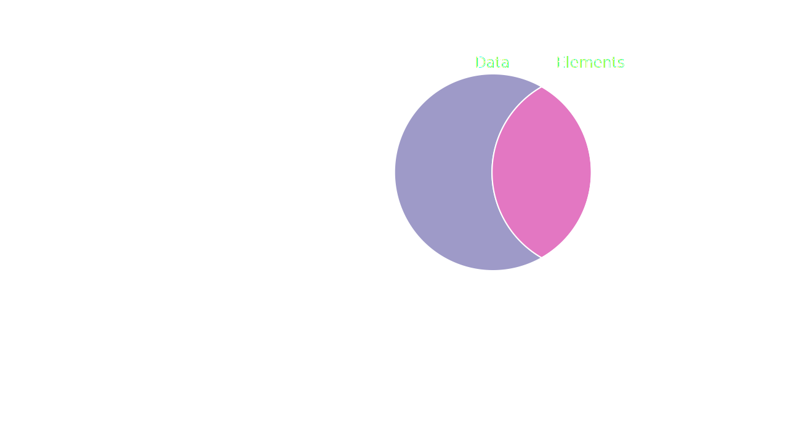

## Entering nodes are added to update on append.

>OK, one more special feature of the append method on enter selections. This makes it easier for you to operate on entering and updating elements simultaneously, without needing to reselect after computing the data join. This reduces code duplication.

---

# Key Function

## You can control the join; by default, the join is by index.

>You can ignore key functions if you are creating static visualizations; you usually need a key function only if you are doing transitions and want to maintain object constancy.

---

```javascript
// A scatterplot, perhaps?
var data = [
  {name: "Alice", x: 10.0, y: 9.14},
  {name:   "Bob", x:  8.0, y: 8.14},
  {name: "Carol", x: 13.0, y: 8.74},
  {name:  "Dave", x:  9.0, y: 8.77},
  {name: "Edith", x: 11.0, y: 9.26}
];
```

## If needed, data should have a unique key for joining.

---

```javascript
function key(d) { return d.name; }

var circle = svg.selectAll("circle")
    .data(data, key)
    .attr("cx", x)
    .attr("cy", y)
    .attr("r", 2.5);
```

## The key function returns a unique string for each datum.

---

# Loading Data

## D3 provides several convenience routines using [XMLHttpRequest](https://www.w3.org/TR/XMLHttpRequest/).

>Loading data isn’t core feature of D3 _per se_, but since it’s commonly needed, there are a few built-in convenience methods.

---

# CSV

## Comma-Separated Values: [d3.csv](https://github.com/mbostock/d3/wiki/CSV)

---

```csv
symbol,date,price
S&P 500,Jan 2000,1394.46
S&P 500,Feb 2000,1366.42
S&P 500,Mar 2000,1498.58
S&P 500,Apr 2000,1452.43
S&P 500,May 2000,1420.6
S&P 500,Jun 2000,1454.6
S&P 500,Jul 2000,1430.83
```

## [stocks.csv](https://bost.ocks.org/mike/d3/workshop/stocks.csv)

---

```javascript
var format = d3.time.format("%b %Y");

d3.csv("stocks.csv", function(stocks) {
  stocks.forEach(function(d) {
    d.price = +d.price;
    d.date = format.parse(d.date);
  });
});
```

## CSV is untyped, so coercion from strings is required.

>The array.forEach method is a built-in JavaScript method to iterate over all elements in an array (here rows in the loaded CSV file).

---


## [area-chart.html](https://bost.ocks.org/mike/d3/workshop/area-chart.html)

---

# JSON

## JavaScript Object Notation: [d3.json](https://github.com/mbostock/d3/wiki/Requests#wiki-d3_json)

>Use JSON rather than JSONP, if you can; JSONP is insecure (and as often practiced, synchronous). For loading cross-domain data, use the Access-Control-Allow-Origin: \* header instead.

---

```javascript
[{"symbol": "S&P 500", "date": "Jan 2000", "price": 1394.46},
 {"symbol": "S&P 500", "date": "Feb 2000", "price": 1366.42},
 {"symbol": "S&P 500", "date": "Mar 2000", "price": 1498.58},
 {"symbol": "S&P 500", "date": "Apr 2000", "price": 1452.43},
 {"symbol": "S&P 500", "date": "May 2000", "price": 1420.6},
 {"symbol": "S&P 500", "date": "Jun 2000", "price": 1454.6},
 {"symbol": "S&P 500", "date": "Jul 2000", "price": 1430.83},
 {"symbol": "S&P 500", "date": "Aug 2000", "price": 1517.68},
 {"symbol": "S&P 500", "date": "Sep 2000", "price": 1436.51},
 {"symbol": "S&P 500", "date": "Oct 2000", "price": 1429.4},
 {"symbol": "S&P 500", "date": "Nov 2000", "price": 1314.95},
 {"symbol": "S&P 500", "date": "Dec 2000", "price": 1320.28},
 {"symbol": "S&P 500", "date": "Jan 2001", "price": 1366.01}…
```

## [stocks.json](https://bost.ocks.org/mike/d3/workshop/stocks.json)

---

```javascript
var format = d3.time.format("%b %Y");

d3.json("stocks.json", function(stocks) {
  stocks.forEach(function(d) {
    d.date = format.parse(d.date);
  });
});
```

## JSON is typed, but you must still parse dates.

>Another option is to represent dates as UNIX epoch milliseconds or ISO 8601 strings, in which case you can use the Date constructor rather than a time format.

---

# Data is Asynchronous

## Code that depends on data must be invoked via callback.

>D3 doesn’t provide any synchronous methods for loading data; loading data asynchronously should give a better experience for your users, since the browser won’t stall while data is loading.

---

# Data is Messy

## Data is rarely in the exact format needed for visualization.

>This doesn’t scratch the surface of the data cleaning problem. For that, see projects such as Google Refine and Stanford’s Data Wrangler.

---

# **array.** { [filter](https://developer.mozilla.org/en/JavaScript/Reference/Global_Objects/Array/filter), [map](https://developer.mozilla.org/en/JavaScript/Reference/Global_Objects/Array/map), [sort](https://developer.mozilla.org/en/JavaScript/Reference/Global_Objects/Array/sort),…}

## JavaScript has a number of useful built-in array methods.

>Deferring data transformations to the client often makes it easier for you to prototype visualizations rapidly; you can change the data on-the-fly rather than needing to re-run your data pipeline. On the other hand, when you want to share your visualization with the world, it’s a good idea to optimize your dataset for performance.

---

# **d3.** { [nest](https://github.com/mbostock/d3/wiki/Arrays#wiki-d3_nest), [keys](https://github.com/mbostock/d3/wiki/Arrays#wiki-d3_keys), [values](https://github.com/mbostock/d3/wiki/Arrays#wiki-d3_values),…}

## D3 also has a variety of data-transform methods; explore the [API](https://github.com/mbostock/d3/wiki/API-Reference).

---

# Scales **&** Axes

---

# Scales

---

# **Data** ↦ **Attributes**

## Attributes (and styles) control position and appearance.

>We use the data join to maintain the mapping from data to elements, but what about the mapping from data to attributes? We need to compute attributes from data to generate visual encodings (position, color, _etc._ ). Scales help with this.

---

# **Domain** ↦ **Range**

## Scales are functions that map from data-space to visual-space.

>Some scales can also go the other way and compute an inverse mapping from range to domain (the scale.invert method); this is useful for interaction.

---

```javascript
function x(d) {
  return d * 42 + "px";
}
```

## Scales are convenient but optional; you can roll your own.

>The function x, here, is a linear scale. But it’s a pain to implement scales this way because you end up hard-coding the scale factor (e.g., 42).

---

# Quantitative Scales

## Map a continuous (numeric) domain to a continuous range.

---

```javascript
var x = d3.scale.linear()
    .domain([12, 24])
    .range([0, 720]);

x(16); // 240
```

## A linear scale simply translates and scales.

>The domain of a scale is the expected data values (here from 12 to 24), while the range is the desired output values (0 is the left side of the chart, and 720 is the right side of the chart). Thus, this scale implements a position encoding.

---

```javascript
var x = d3.scale.sqrt()
    .domain([12, 24])
    .range([0, 720]);

x(16); // 268.9056992603583
```

## A sqrt (or pow) scale applies an exponential transform.

>Sometimes you want to transform the data as part of the encoding. For example, you might use a square-root scale when computing the radius of a circle, so that the area is proportional to the associated data value.

---

```javascript
var x = d3.scale.log()
    .domain([12, 24])
    .range([0, 720]);

x(16); // 298.82699948076737
```

## A log scale applies a logarithmic transform.

>Be careful that your log scale’s domain never crosses zero (which is at infinity)!

---

# Domains **&** Ranges

## Typically, domains are derived from data while ranges are constant.

---

```javascript
var x = d3.scale.linear()
    .domain([0, d3.max(numbers)])
    .range([0, 720]);
```

## Use [d3.min](https://github.com/mbostock/d3/wiki/Arrays#wiki-d3_min) and [d3.max](https://github.com/mbostock/d3/wiki/Arrays#wiki-d3_max) to compute the domain.

---

```javascript
var x = d3.scale.log()
    .domain(d3.extent(numbers))
    .range([0, 720]);
```

## Use [d3.extent](https://github.com/mbostock/d3/wiki/Arrays#wiki-d3_extent) to compute the min and max simultaneously.

---

```javascript
function value(d) { return d.value; }

var x = d3.scale.log()
    .domain(d3.extent(objects, value))
    .range([0, 720]);
```

## Use an accessor function to derive a numeric value for objects.

>If you prefer, you can use array.map instead of an accessor function.

---

# Interpolators

## Quantitative scales support multiple interpolators.

>D3 has a powerful set of interpolators that are used by scales and transitions. It’s good to understand how interpolators work. Occasionally you might also find a reason to use an interpolator directly, or to write your own custom interpolator.

---

```javascript
var x = d3.scale.linear()
    .domain([12, 24])
    .range(["steelblue", "brown"]);

x(16); // #666586
```

## Colors are detected automatically for RGB interpolation.

>D3 understands CSS2 colors (such as "#FFF" and "rgb(255,0,0)"). D3 might support perceptual color spaces in the future, namely CIE L\*a\*b\*.

---

```javascript
var x = d3.scale.linear()
    .domain([12, 24])
    .range(["0px", "720px"]);

x(16); // 240px
```

## String interpolation matches embedded numbers; quite flexible.

>Generic string interpolation can be used for CSS positions and sizes (which unlike CSS require units, such as "px" or "em"), for SVG path data, and other applications.

---

```javascript
var x = d3.scale.linear()
    .domain([12, 24])
    .range(["steelblue", "brown"])
    .interpolate(d3.interpolateHsl);

x(16); // #3cb05f
```

## Interpolators can be set explicitly, if desired.

>Use HSL interpolation judiciously; rainbow color scales (hue interpolation) are a generally-accepted bad practice.

---

```javascript

```


## You can even interpolate objects!

>Mousemove to see this demo. This slide is contrived, but object interpolation is often used for transitions of complex data objects, such as donut charts or sunburst layouts.

---

# Diverging Scales

## [Sometimes](https://mbostock.github.com/d3/talk/20111018/calendar.html), you want a compound (“polylinear”) scale.

---

```javascript
var x = d3.scale.linear()
    .domain([-10, 0, 100])
    .range(["red", "white", "green"]);

x(-5); // #ff8080
x(50); // #80c080
```

## The domain and range can have more than two values!

---

# Ordinal Scales

## Map a discrete domain to a discrete range.

---

```javascript
var x = d3.scale.ordinal()
    .domain(["A", "B", "C", "D"])
    .range([0, 10, 20, 30]);

x("B"); // 10
```

## An ordinal scale is essentially an explicit mapping.

>You wouldn’t normally use an ordinal scale this way, but I’m including it as the most direct example of what an ordinal scale does. The first element in the domain is mapped to the first element in the range, and so on.

---

```javascript
var x = d3.scale.category20()
    .domain(["A", "B", "C", "D"]);

x("B"); // #aec7e8
```

## Ordinal scales are often used to assign categorical colors.

---

```javascript
var x = d3.scale.category20()
    .domain(["A", "B", "C", "D"]);

x("E"); // #2ca02c
x("E"); // #2ca02c
x.domain(); // A, B, C, D, E
```

## Unknown values are implicitly added to the domain.

>You often don’t need to assign a domain explicitly with a categorical color scale; you can just start passing data to the scale and it will do the right thing. However, if you want a deterministic mapping (for example, the same colors across datasets or pages), then you’ll want to define the domain explicitly; otherwise it is order-dependent.

---

_Figure 11_

_Figure 12_

_Figure 13_

_Figure 14_

## A handful of color scales are built-in; see also [ColorBrewer](http://colorbrewer2.org/).

---

```javascript
var x = d3.scale.ordinal()
    .domain(["A", "B", "C", "D"])
    .rangePoints([0, 720]);

x("B"); // 240
```

## Ordinal ranges can be derived from continuous ranges.

>The rangePoints method might be used with an ordinal scatterplot.

---

```javascript
var x = d3.scale.ordinal()
    .domain(["A", "B", "C", "D"])
    .rangeRoundBands([0, 720], .2);

x("B"); // 206, bar position
x.rangeBand(); // 137, bar width
```

## Ordinal ranges are particularly useful for bar charts.

>Here the scale returns the position of the left-side of the bar, while the rangeBand method returns the bar width. The second argument to rangeBands (here,.2) is the amount of padding to reserve between bars. The rangeRoundBands method is the same as rangeBands, except it rounds to whole pixels to avoid blurry anti-aliasing.

---

# Axes

## D3 provides convenient labeling for scales.

>In earlier releases, you had to label the axes yourself! The d3.svg.axis component makes things much easier.

---

```javascript
var yAxis = d3.svg.axis()
    .scale(y)
    .orient("left");
```

## Create an axis for a given scale, and configure as desired.

>There are a variety of other properties you might want to configure on an axis, such as the number of ticks or the tick format.

---

```javascript
svg.append("g")
    .attr("class", "y axis")
    .call(yAxis);
```

## Render the axis by calling a `<g>` selection.

>You can also call the axis on a transition to animate changes to the domain!

---

```css
.axis path, .axis line {
  fill: none;
  stroke: #000;
  shape-rendering: crispEdges;
}
```

## Customize axis appearance via CSS.

>The CSS snippet here is a good default appearance for axes, but you can customize it however you like. The next slide shows a ggplot2-inspired appearance.

---


---

# Ticks

## Quantitative scales can be queried for “human-readable” values.

---

```javascript
var x = d3.scale.linear()
    .domain([12, 24])
    .range([0, 720]);

x.ticks(5); // [12, 14, 16, 18, 20, 22, 24]
```

## The requested count is only a hint (for better or worse).

---

# Tick Formats

## See [d3.format](https://github.com/mbostock/d3/wiki/Formatting#wiki-d3_format) and [d3.time.format](https://github.com/mbostock/d3/wiki/Time-Formatting#wiki-format).

---

# Marks

>Marks, as in graphical marks or shapes: the various ways in which you can represent a data point visually.

---

# SVG Coordinates

## Absolute positioning; the origin ⟨0,0⟩ is the top-left corner!

>Because the origin is in the top-left rather than bottom-left, you often see y-scales with an inverted range (e.g., [height, 0]).

---

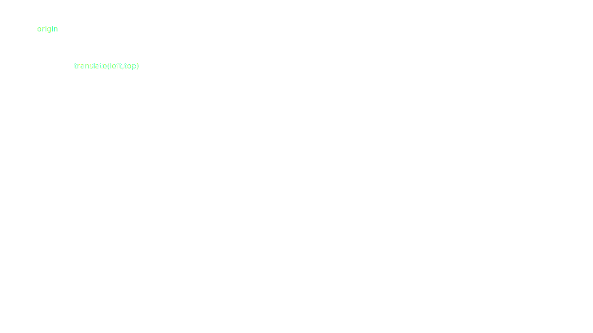

## Use transforms to define a new origin.

>The "transform" attribute on `<g>` elements lets you define a new coordinate system. A translate lets you shift the origin based on margins; this approach is convenient because you isolate the margin definition to a single place in your code.

---

```javascript
var svg = d3.select("body").append("svg")
    .attr("width", outerWidth)
    .attr("height", outerHeight);

var g = svg.append("g")
    .attr("transform", "translate("
      + marginLeft + ","
      + marginTop + ")");
```

## Use margins for decorative elements, such as axes.

---

# SVG Basic Shapes

## [SVG Spec](https://www.w3.org/TR/SVG/shapes.html)

---

```html
<rect
    x="0"
    y="0"
    width="0"
    height="0"
    rx="0"
    ry="0">
```

## Rect


>Note that position and size must be defined as attributes in SVG, rather than styles. Colors and opacity should be specified as CSS, however.

---

```html
<circle
    cx="0"
    cy="0"
    r="0">
```

## Circle


>Don’t forget the r attribute, or your circles will be invisible!

---

```html
<line
    x1="0"
    y1="0"
    x2="0"
    y2="0">
```

## Line


>Mousemove?

---

```html
<text
    x="0"
    y="0"
    dx="0"
    dy="0"
    text-anchor="start">
```

## Text


>SVG is designed to be agnostic about text direction (left-to-right vs. right-to-left), so the text-anchor attribute can have the values "start", "middle" and "end".

---

```html
<text dy="0">bottom</text>
<text dy=".35em">middle</text>
<text dy=".71em">top</text>
```

## Vertical alignment of text is slightly awkward.

---

# SVG Paths

## [SVG Spec](https://www.w3.org/TR/SVG/paths.html#PathData)

---

```html
<path d="M152.64962091501462,320.5600780855698L133.88913955606318,325.4363177123538L134.96890954443046,330.37917634921996L131.19348249532786,331.158393614812L98.56681109628815,335.53933807857004L91.14450799488135,333.79662025279L72.1880101321918,333.74733970068166L69.51723455785742,332.8569681440152L62.37313911354066,333.2100666843387L62.248334309137434,335.3677272708405L58.843440998888326,335.0574959605036L53.97667317214221,331.36075125633175L56.30952738118711,325.9417994311851L63.80207296237137,326.0219658098969L68.37010032001055,321.68160223702955L68.82177412097933,318.08112591435287L73.34…">
```

## Paths require another mini-language!

>It’s occasionally useful to generate path strings by hand, but since this is cumbersome, D3 provides ways to construct common path types from data.

---

# Path Generators

## Configurable functions for generating paths from data.

---

# [d3.svg.line](https://github.com/mbostock/d3/wiki/SVG-Shapes#wiki-line)

## Define a path in terms of _x_ and _y_.

---

```javascript
var x = d3.scale.linear(),
    y = d3.scale.linear();

var line = d3.svg.line()
    .x(function(d) { return x(d.x); })
    .y(function(d) { return y(d.y); });
```

## Compose scales with data accessors to define position.

---

```javascript
svg.append("path")
    .datum(objects)
    .attr("class", "line")
    .attr("d", line);
```

## Pass data to the line generator directly, or via selection.attr.

>The datum operator lets you bind data to elements without computing a data-join; in this case, we’re assigning a single data point to a single element. The confusing part is that this single data point is actually an array of objects—since we’re using a single path element to visualize an array of data points. So occasionally the concept of mapping data to elements isn’t exactly one-to-one.

---

# [d3.svg.area](https://github.com/mbostock/d3/wiki/SVG-Shapes#wiki-area)

## Define a path in terms of _x_, _y0_ and _y1_.

---

```javascript
var x = d3.scale.linear(),
    y = d3.scale.linear();

var area = d3.svg.area()
    .x(function(d) { return x(d.x); })
    .y0(height)
    .y1(function(d) { return y(d.y); });
```

## For non-stacked area charts, _y0_ is constant.

---


## For streamgraphs, use [d3.layout.stack](https://github.com/mbostock/d3/wiki/Stack-Layout) to compute the baseline.

---

# Line Interpolators

## Line and area generators support multiple interpolation modes.

---

# Linear Interpolation


>Mousemoooooove.

---

# Step Interpolation


>Step-before and step-after interpolation are handy for bar charts, and for visualizing step functions (values that change instantaneous­ly rather than gradually).

---

# Basis Interpolation


>Note that with basis interpolation, the line doesn’t always go through the control point. D3 also provides cardinal and cubic monotone interpolation; the latter is generally preferred to avoid misleading.

---

# Radial Areas **&** Lines

## Similar to d3.svg. **{** area **,** line **}**, except in polar coordinates.

>See the examples included in the git repository.

---

# [d3.svg.arc](https://github.com/mbostock/d3/wiki/SVG-Shapes#wiki-arc)

## A path generator for pie and donut charts, among other uses.

---

```javascript
var myArc = {
  "innerRadius": 0,
  "outerRadius": 360,
  "startAngle": 0, // 12 o'clock
  "endAngle": 1.2 // radians
};
```

## By default, takes as input an object with arc-related properties.

---

```javascript
var arc = d3.svg.arc()
    .innerRadius(0)
    .outerRadius(360);
```

## Override the accessors to set constant properties.

>If you define the inner and outer radius as constants, you no longer need to specify them as properties on the input objects; so this arc generator could take as input {startAngle: 0, endAngle: 1.2}.

---

```javascript
// construct a default pie layout
var pie = d3.layout.pie();

// derive data to feed to d3.svg.arc
var myArcs = pie(numbers);
```

## Use d3.layout.pie to compute start and end angles from data.

>The pie layout returns data objects with startAngle and endAngle properties that you can feed to d3.svg.arc.

---

# Layouts

---

# Layouts are Data

## Layouts are reusable algorithms that generate data, not display.

>This abstract approach makes it easier to reuse layouts in interesting ways, such as combining the cluster layout with the bundle layout for hierarchical edge bundling, or using layouts to render to canvas rather than SVG.

---

# Layouts are Varied

## Each layout is different. Most are stateless, but not all.

---

# Hierarchical Layouts

## There are lots of ways to visualize hierarchical data!

---

## [d3.layout.treemap](https://mbostock.github.com/d3/talk/20111018/treemap.html)

>← That’s a link to a cool demo. Maybe you should click it. You should probably click it.

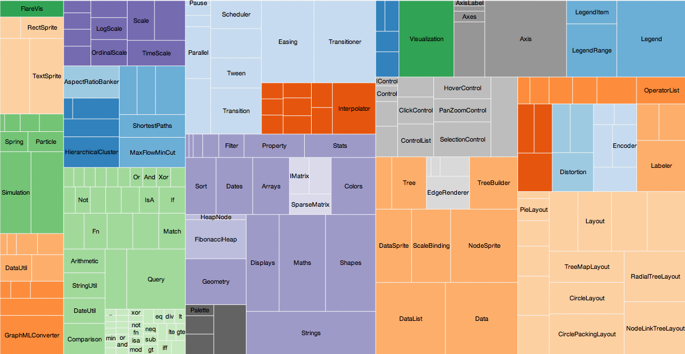

---

## [d3.layout.tree](https://mbostock.github.com/d3/talk/20111018/tree.html)

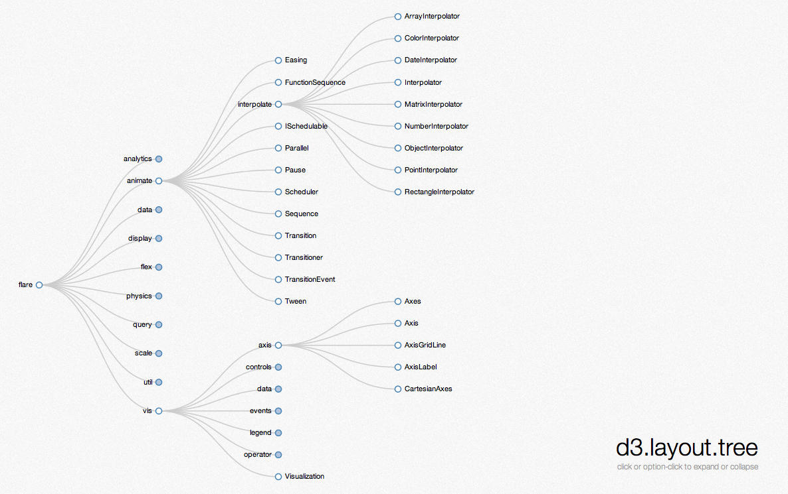

---

## [d3.layout.pack](https://mbostock.github.com/d3/talk/20111018/pack.html)

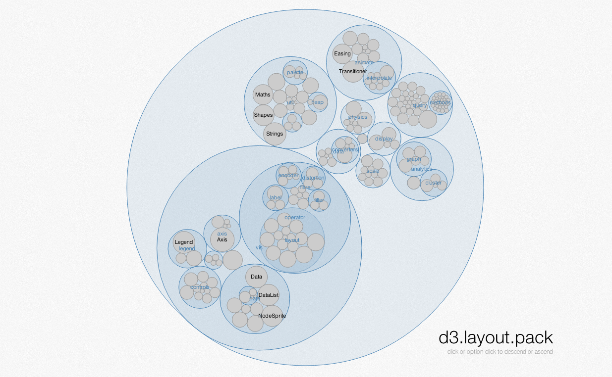

---

## [d3.layout.partition](https://mbostock.github.com/d3/talk/20111018/partition.html)

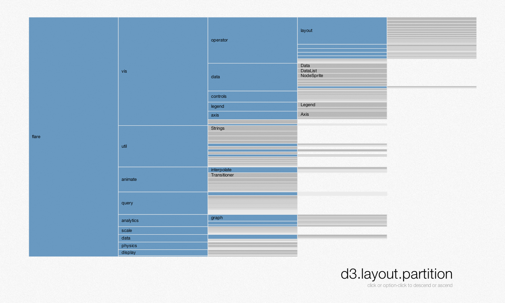

---

```javascript
var parent = {"children": […]},
     child = {"value": …};
```

## The hierarchical layouts use a shared representation of data.

>You can use a different representation of data by changing the layout’s accessor functions, but most of the time it’s easiest to stick to the default data format.

---

```javascript
var treemap = d3.layout.treemap()
    .padding(4)
    .size([width, height]);
```

## Layouts are configurable functions.

>For example, here the padding controls the space reserved between a parent node in the treemap and its children. For a treemap, padding is necessary so that you can see the hierarchical structure; if you don’t use padding, you’ll want to use some other way of indicating the hierarchy, such as color.

---

```javascript
function x(d) { return d.x; }
function y(d) { return d.y; }
function dx(d) { return d.dx; }
function dy(d) { return d.dy; }
```

## The layout populates position properties on the nodes.

>This slide shows accessor functions for retrieving the layout’s computed properties; these accessor functions are used on the next slide to display the layout.

---

```javascript
svg.selectAll(".cell")
    .data(treemap.nodes(root))
  .enter().append("rect")
    .attr("class", "cell")
    .attr("x", x)
    .attr("y", y)
    .attr("width", dx)
    .attr("height", dy);
```

## By accessing those properties, you can visualize the layout.

---

## [d3.layout.force](https://mbostock.github.com/d3/talk/20111116/force-collapsible.html) [(talk)](https://vimeo.com/29458354)

>Force layouts are commonly used for visualizing networks, but they can also be used for fuzzy position encoding. For example, beeswarm plots are variants of scatterplots that use collision detection: rather than overplotting, coincident dots are pushed apart. I gave a talk on force layouts a few months back that explains how these simulations work, and various interesting applications.

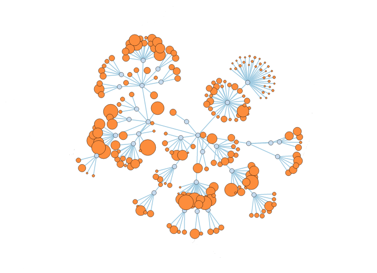

---

## [d3.layout.bundle](https://mbostock.github.com/d3/talk/20111116/bundle.html)

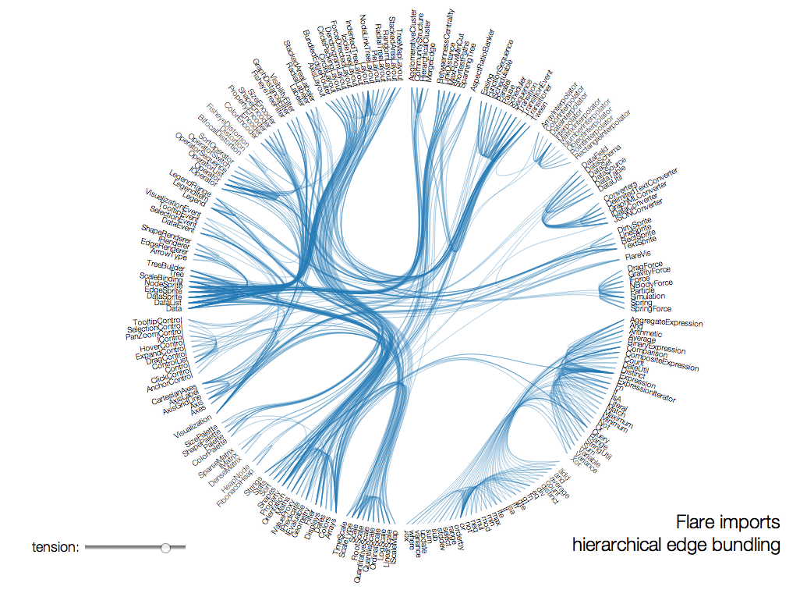

---

## [d3.geom.voronoi](https://mbostock.github.com/d3/talk/20111116/airports.html)

>D3’s voronoi implementation is effectively a layout, but it lives in the d3.geom package. Voronoi diagrams are useful for scatterplots and other displays with small graphical elements: use the voronoi to find the closest point to the mouse. See also Tovi Grossman’s CHI 2005 paper on Bubble Cursors.

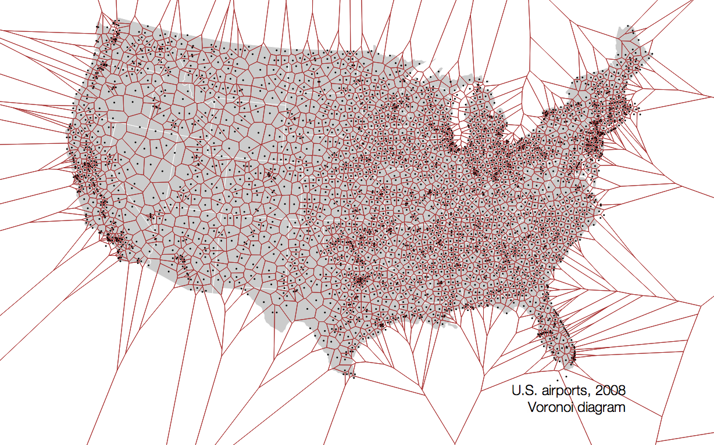

---

## [d3.layout.chord](https://bost.ocks.org/mike/uberdata/)

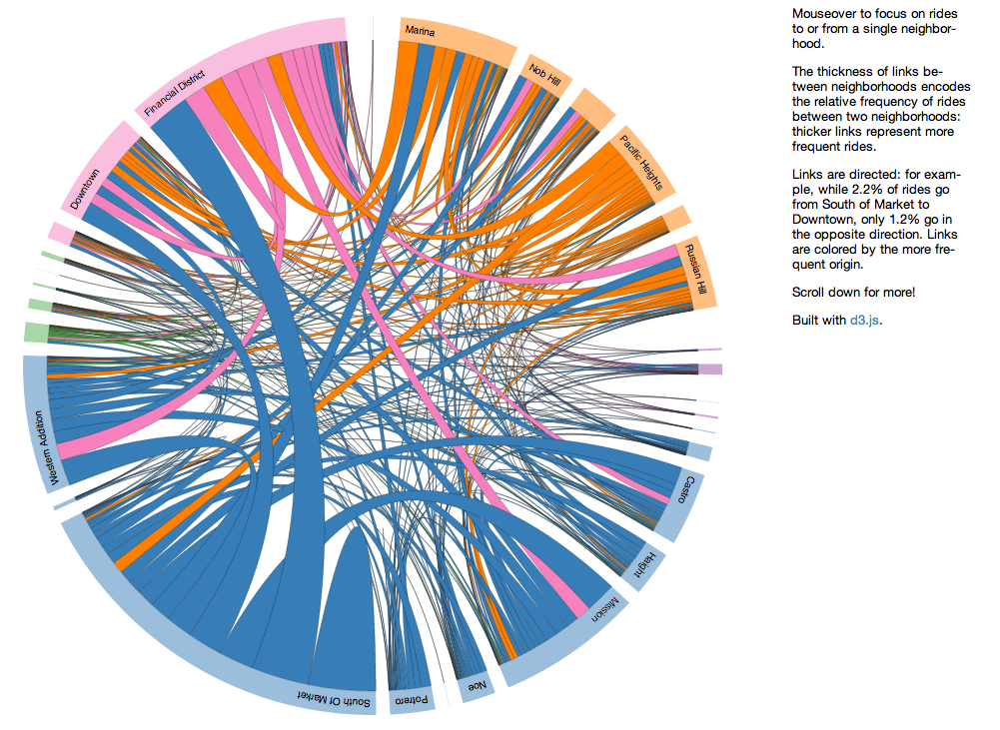

---

# Chart Components

## Reuse code through [configurable functions](https://bost.ocks.org/mike/chart/).

>D3 has a number of reusable components; I didn’t cover all of them in the workshop. I recently wrote an article outlining a [lightweight convention](https://bost.ocks.org/mike/chart/) for reusable components. You might find it useful when implementing your own visualizations.

---

## [Mike Bostock](https://bost.ocks.org/mike/) @mbostock

>Kudos for reading all 150+ slides! These slides were built with [stack.js](https://github.com/mbostock/stack).